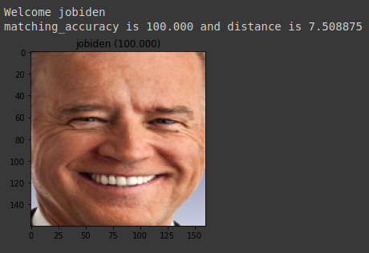
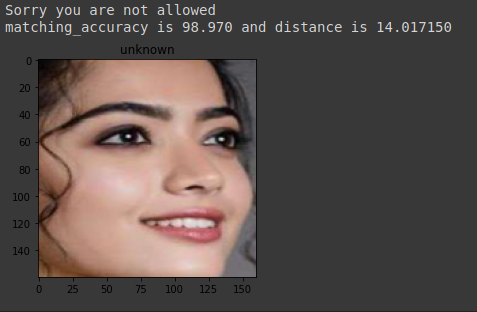

# Face-Recognition
This is a keras implementation of the face recognizer described in the paper ["FaceNet: A Unified Embedding for Face Recognition and Clustering"](https://arxiv.org/abs/1503.03832). The project also uses ideas from [Andrew Ng](https://www.google.com/url?sa=t&rct=j&q=&esrc=s&source=web&cd=&cad=rja&uact=8&ved=2ahUKEwjD_p_d6NnqAhVF6nMBHYyKCPUQFjAAegQIARAB&url=https%3A%2F%2Fen.wikipedia.org%2Fwiki%2FAndrew_Ng&usg=AOvVaw2LbWH5rpY5AMpcPkIpID2t)'s last week assignment of Deep Learning course Convolutional Neural Network on [Coursera](https://www.coursera.org).

## Installation
[MTCNN](https://arxiv.org/abs/1604.02878) is available as pip pakage.
It can be installed through pip:
```
$ pip install mtcnn
```
### Requirement
OpenCV >=4.1

Keras >=2.0.0

numpy >=1.9.1

scipy >=0.14

python >=3.4

## Pre-trained Models
[FaceNet](https://arxiv.org/abs/1503.03832) is used as pre-trained Model. [MTCNN](https://github.com/ipazc/mtcnn) is used to extract faces from images, these extracted faces are used to get embedding using pre-trained FaceNet model.

## Training Data
There is no  need to train FaceNet but to train SVC classifier [this](https://www.kaggle.com/adg1822/7-celebrity-images) dataset is used. 

Dataset


The train folder contains 15 images of each person, val folder contains 5 images of each person and unknown folder contains 8 images of unknown person. 

## Model
SVC classifier is used with [Distance method](https://github.com/adg1822/Face-Recognition/blob/master/Notebook/Distance%20method.ipynb).

Train SVC classifier on training data using embedding. Make a database of embedding of known persons using single clear face image and use Distance method by calculating minnimum distance between new person's embedding and our database.

Define a [function](Functions/getclass.py) to combine both method.

## Features
MTCNN finds faces in pictures.([function](Functions/get_extracted_face.py)) 


### Recognize person in image

Identify face in picture


Unknown person/ unauthorised person


## Results

#### Known person



#### Unknown person



## Performance
f1_score is 1 when we check performance on authorised persons and f1_score is 0.976462298 when model is tested on unauthorised persons also. 
