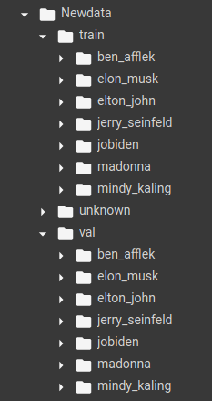
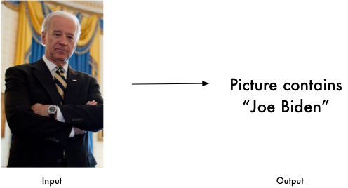

# Face-Recognition
This is keras implementetion of the face recognizer described in the paper ["FaceNet: A Unified Embedding for Face Recognition and Clustering"](https://arxiv.org/abs/1503.03832). The project also uses ideas from [Andrew Ng](https://www.google.com/url?sa=t&rct=j&q=&esrc=s&source=web&cd=&cad=rja&uact=8&ved=2ahUKEwjD_p_d6NnqAhVF6nMBHYyKCPUQFjAAegQIARAB&url=https%3A%2F%2Fen.wikipedia.org%2Fwiki%2FAndrew_Ng&usg=AOvVaw2LbWH5rpY5AMpcPkIpID2t)'s last weak assignment of Deep Learning course Convolutional Neural Network on [Coursera](https://www.coursera.org).

## Installation
[MTCNN](https://arxiv.org/abs/1604.02878) is availabel as pip pakage.
Currently it is only supported Python3.4 onwards. It can be installed through pip:
```
$ pip install mtcnn
```
This implementation requires:
>OpenCV>=4.1, Keras>=2.0.0, numpy>=1.9.1, scipy>=0.14, python>=3.4

## Pre-trained Models
A couple of pre-trained model are used [FaceNet](https://arxiv.org/abs/1503.03832) and [MTCNN](https://arxiv.org/abs/1604.02878). [MTCNN](https://github.com/ipazc/mtcnn) is used to extract faces from images, these extracted faces are used to get embedding using pre-trained FaceNet model.

## Training Data
There is no  need to train FaceNet or MTCNN models but to train SVC classifier this dataset is used. 

Dataset



The train folder contain 15 images of each person, val folder contain 5 images of each person and unknown folder contain 8 images of unknown person. 

## Model
This is combination of two models: SVC classifier and [Distance method](Notebook/Distance methode.ipynb)

Train SVC classifier on training data using embedding. Make a database of embedding of known persons using single clear face image and use Distance method by calculating distance minnimum distance between new person's embedding and our database.

Define a [function](Functions/getclass.py) to combine both method.

## Features
Find faces in pictures


Identify faces in pictures



Recognize who appears in each photo.

Unkown person


## Performance

f1_score is 0.99999
